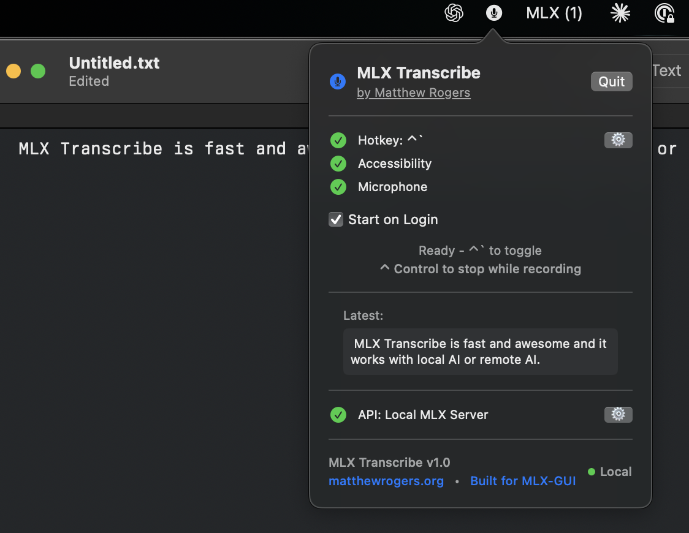
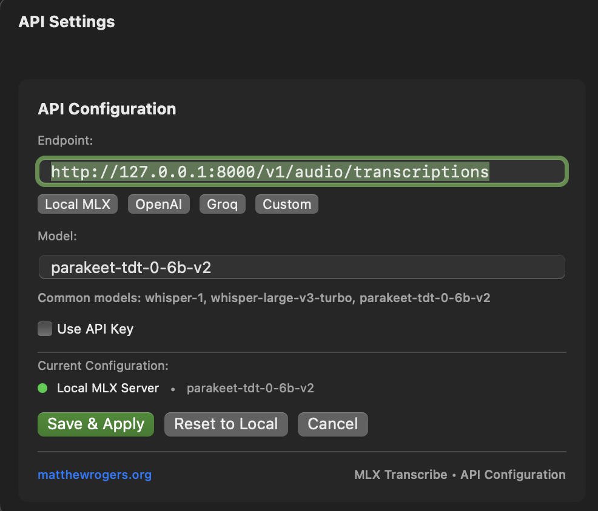

# 🎤 MLX-Transcribe


<p align="center">*Press "Control + ~" → Speak → Text appears instantly at your cursor*</p>

---

> 🚀 **Lightning-fast AI transcription directly at your cursor** - The fastest way from voice to text

[](LICENSE)
[](https://www.apple.com/macos/)
[](https://github.com/RamboRogers/MLX-Transcribe/releases)
[](https://github.com/RamboRogers/MLX-Transcribe)

## 🎯 What is MLX-Transcribe?

MLX-Transcribe is a ***NATIVE SIGNED*** **privacy-first**, **lightning-fast** transcription app for macOS that transforms your voice into text instantly at your cursor position. Built with Apple Silicon optimization and seamless integration with [MLX-GUI](https://github.com/RamboRogers/mlx-gui), it's the perfect tool for developers, writers, and anyone who values speed and privacy.



### 🔥 Key Features

- **⚡ Instant Transcription** - Press ``` Control + ` ```  and speak - text appears instantly at your cursor
- **🤖 Local AI First** - Seamless [MLX-GUI](https://github.com/RamboRogers/mlx-gui) integration with automatic model management
- **🛡️ Privacy Focused** - Your voice never leaves your machine with local processing
- **🎛️ Multi-API Support** - Works with Local MLX, OpenAI, and Groq endpoints
- **⌨️ Customizable Hotkeys** - Configure any key combination that works for you
- **🎯 Universal Cursor** - Works in any app - text editors, browsers, chat apps, terminals
- **🚀 Menu Bar Native** - Lightweight, always-accessible menu bar app
- **🔄 Auto-Install Models** - Automatically downloads and loads Parakeet models via MLX-GUI
- **🏃‍♂️ Startup Ready** - Optional login item for seamless workflow integration


## 🚀 Quick Install

1. Download the latest release from [Releases](https://github.com/RamboRogers/MLX-Transcribe/releases)
2. Open the `.zip` file and drag MLX-Transcribe to Applications
3. Launch and grant accessibility permissions when prompted

## ⚙️ Setup

### 1. 🎤 Microphone Permission
MLX-Transcribe will automatically request microphone access on first launch.

### 2. 🔓 Accessibility Permission
For text insertion at cursor:
1. Click "Grant Accessibility" in the menu bar popup
2. Add MLX-Transcribe to Privacy & Security → Accessibility
3. **Restart the app** after granting permission

### 3. 🤖 AI Configuration
- **Local MLX** (Default): Integrates with [MLX-GUI](https://github.com/RamboRogers/mlx-gui) - models auto-install
- **OpenAI**: Add your API key in settings
- **Groq**: Add your Groq API key for fast cloud transcription

## 🎮 Usage

### Basic Transcription
1. **Press `Control + ~`** (or your custom hotkey)
2. **Speak clearly** while you see the red recording indicator
3. **Press `Control + ~`** to stop recording, or `Control + ~` again
4. **Text appears instantly** at your cursor position

### Menu Bar Controls
Click the 🎤 icon in your menu bar to:
- View transcription status
- Configure hotkeys and API settings
- Enable "Start on Login"
- Check permissions and connection status

### Pro Tips
- **Best Results**: Speak clearly and pause briefly between sentences
- **Quick Stop**: Press `Control + ~` while recording to stop immediately
- **Works Everywhere**: Terminal, VS Code, Slack, browsers, documents
- **Privacy Mode**: Use local MLX processing to keep everything offline

## 🛠️ API Configurations



### 🏠 Local MLX (Recommended)
```
Endpoint: http://127.0.0.1:8000/v1/audio/transcriptions
Model: parakeet-tdt-0-6b-v2 (auto-installed)
API Key: Not required
```

### ☁️ OpenAI
```
Endpoint: https://api.openai.com/v1/audio/transcriptions
Model: whisper-1
API Key: Required (sk-...)
```

### ⚡ Groq
```
Endpoint: https://api.groq.com/openai/v1/audio/transcriptions
Model: whisper-large-v3-turbo
API Key: Required (gsk_...)
```

## 🖥️ System Requirements

- **macOS**: 12.0 (Monterey) or later
- **Architecture**: Intel x86_64 or Apple Silicon (arm64)
- **Memory**: 4GB RAM minimum, 8GB recommended
- **Storage**: 50MB for app, additional space for local models
- **For Local MLX**: [MLX-GUI](https://github.com/RamboRogers/mlx-gui) installed and running

## 🔧 Advanced Configuration

### Custom Hotkeys
Popular combinations:
- `Control + ~` (Default) - Great for developers
- `Shift + Tab` - Alternative option
- `Option + Space` - Quick access
- `F5` - Function key option

### Keyboard Shortcuts
- **Start/Stop Recording**: Your configured hotkey (default: `Control + ~`)
- **Force Stop**: `Control + ~` (while recording)
- **Open Menu**: Click menu bar icon


## 🤝 Contributing

We welcome contributions! Here's how you can help:

1. **🐛 Report Issues**: Found a bug? [Open an issue](https://github.com/RamboRogers/MLX-Transcribe/issues)
2. **💡 Feature Requests**: Have an idea? We'd love to hear it!
3. **🔧 Code Contributions**: Fork, branch, commit, and PR
4. **📖 Documentation**: Help improve our docs and examples
5. **⭐ Star the Repo**: Show your support!

## 📊 Performance

| Metric | Local MLX | OpenAI | Groq |
|--------|-----------|---------|------|
| **Latency** | 🟢 ~2-4s | 🟡 ~3-8s | 🟢 ~1-3s |
| **Privacy** | 🟢 100% Local | 🔴 Cloud | 🔴 Cloud |
| **Accuracy** | 🟢 Excellent | 🟢 Excellent | 🟢 Excellent |
| **Cost** | 🟢 Free | 🟡 $0.006/min | 🟡 $0.00011/min |

## ⭐ Star History

[](https://star-history.com/#RamboRogers/MLX-Transcribe&Date)

## 🔗 Related Projects

- **[MLX-GUI](https://github.com/RamboRogers/mlx-gui)** - The powerful MLX interface that powers local transcription
- **[matthewrogers.org](https://matthewrogers.org)** - Creator's website and blog

## 📜 License

CC BY-NC-SA License - see [LICENSE](LICENSE) file for details.

## 🙏 Acknowledgments

- Built with ❤️ by [Matthew Rogers](https://matthewrogers.org)
- Powered by [MLX-GUI](https://github.com/RamboRogers/mlx-gui) for local AI processing
- Uses Apple's Speech Recognition framework
- Inspired by the need for privacy-first transcription tools

---

**Made with 🎤 and ⚡ for the developer community**

*MLX-Transcribe - Where voice meets code at the speed of thought*